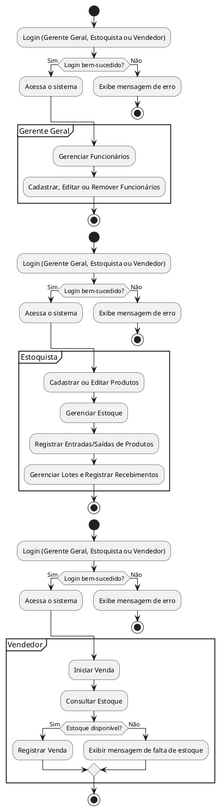

```plantuml-svg
@startuml

start

:Login (Gerente Geral, Estoquista ou Vendedor);
if (Login bem-sucedido?) then (Sim)
    :Acessa o sistema;
else (Não)
    :Exibe mensagem de erro;
    stop
endif

partition "Gerente Geral" {
    :Gerenciar Funcionários;
    :Cadastrar, Editar ou Remover Funcionários;
}

stop

start

:Login (Gerente Geral, Estoquista ou Vendedor);
if (Login bem-sucedido?) then (Sim)
    :Acessa o sistema;
else (Não)
    :Exibe mensagem de erro;
    stop
endif

partition "Estoquista" {
    :Cadastrar ou Editar Produtos;
    :Gerenciar Estoque;
    :Registrar Entradas/Saídas de Produtos;
    :Gerenciar Lotes e Registrar Recebimentos;
}

stop

start

:Login (Gerente Geral, Estoquista ou Vendedor);
if (Login bem-sucedido?) then (Sim)
    :Acessa o sistema;
else (Não)
    :Exibe mensagem de erro;
    stop
endif

partition "Vendedor" {
    :Iniciar Venda;
    :Consultar Estoque;
    if (Estoque disponível?) then (Sim)
        :Registrar Venda;
    else (Não)
        :Exibir mensagem de falta de estoque;
    endif
}

stop

@enduml
```