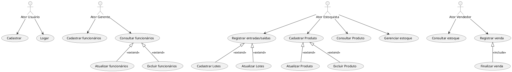

```plantuml-svg
@startuml
actor "Ator Usuário" as Usuario
actor "Ator Gerente" as Gerente
actor "Ator Estoquista" as Estoquista
actor "Ator Vendedor" as Vendedor

Usuario --> (Cadastrar)
Usuario --> (Logar)

Gerente --> (Cadastrar funcionários)
Gerente --> (Consultar funcionários)
(Consultar funcionários) <|-- (Atualizar funcionários) : <<extend>>
(Consultar funcionários) <|-- (Excluir funcionários) : <<extend>>

Estoquista --> (Registrar entradas/saídas)
(Registrar entradas/saídas) <|-- (Cadastrar Lotes) : <<extend>>
(Registrar entradas/saídas) <|-- (Atualizar Lotes) : <<extend>>

Estoquista --> (Cadastrar Produto)
(Cadastrar Produto) <|-- (Atualizar Produto) : <<extend>>
(Cadastrar Produto) <|-- (Excluir Produto) : <<extend>>

Estoquista --> (Consultar Produto)
Estoquista --> (Gerenciar estoque)

Vendedor --> (Consultar estoque)
Vendedor --> (Registrar venda)
(Registrar venda) <|-- (Finalizar venda) : <<include>>

@enduml
```
