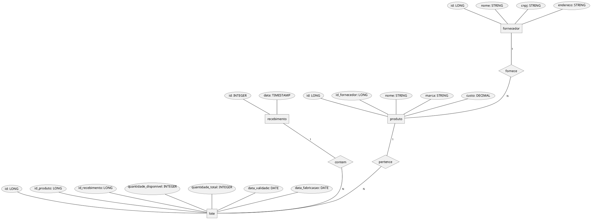
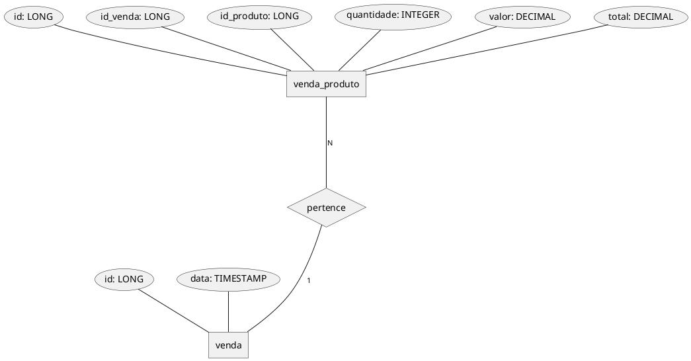
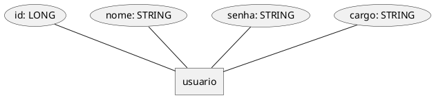

## 1. Diagrama de Estoque

```plantuml-svg
@startchen

entity fornecedor {
	id: LONG
	nome: STRING
	cnpj: STRING
	endereco: STRING
}

entity produto {
	id: LONG
	id_fornecedor: LONG
	nome: STRING
	marca: STRING
	custo: DECIMAL
}

entity lote {
	id: LONG
	id_produto: LONG
	id_recebimento: LONG
	quantidade_disponivel: INTEGER
	quantidade_total: INTEGER
	data_validade: DATE
	data_fabricacao: DATE
}

entity recebimento {
	id: INTEGER
	data: TIMESTAMP
}

relationship fornece {
}

relationship contem {
}

relationship pertence {
}

fornecedor -1- fornece
fornece -N- produto

produto -1- pertence
pertence -N- lote

recebimento -1- contem
contem -N- lote

@endchen
```

## 2. Diagrama de Venda

```plantuml-svg
@startchen

entity venda {
	id: LONG
	data: TIMESTAMP
}

entity venda_produto {
	id: LONG
	id_venda: LONG
	id_produto: LONG
	quantidade: INTEGER
	valor: DECIMAL
	total: DECIMAL
}

relationship pertence {
}

venda_produto -N- pertence
pertence -1- venda

@endchen
```

## 3. Diagrama de Autenticação

```plantuml-svg
@startchen

entity usuario {
	id: LONG
	nome: STRING
	senha: STRING
	cargo: STRING
}

@endchen
```
